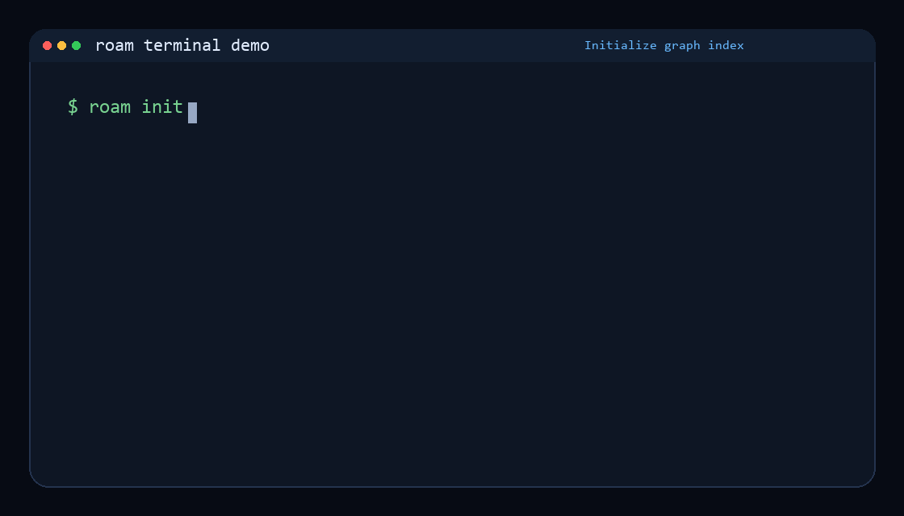

<div align="center">

# roam-code

**Architectural sight for AI coding agents — before they edit.**

A local code graph (SQLite + tree-sitter + git history) that gives any agent — Claude Code, Cursor, Aider, Continue, your own — five high-leverage verbs: `understand`, `retrieve`, `context`, `preflight`, `critique`. The other 148 specialised commands are advanced surface for specialised workflows.

*154 commands · 120 MCP tools · 27 languages · 100% local · zero API keys*

[](https://pypi.org/project/roam-code/)
[](https://github.com/Cranot/roam-code/stargazers)
[](https://github.com/Cranot/roam-code/actions/workflows/roam-ci.yml)
[](https://www.python.org/downloads/)
[](https://opensource.org/licenses/MIT)

</div>

---

## What is Roam?

Roam is a structural intelligence engine for software. It pre-indexes your codebase into a semantic graph -- symbols, dependencies, call graphs, architecture layers, git history, and runtime traces -- stored in a local SQLite DB. Agents query it via CLI or MCP instead of repeatedly grepping files and guessing structure.

Unlike LSPs (editor-bound, language-specific) or Sourcegraph (hosted search), Roam provides architecture-level graph queries -- offline, cross-language, and compact. It goes beyond comprehension: Roam governs architecture through budget gates, simulates refactoring outcomes, orchestrates multi-agent swarms with zero-conflict guarantees, maps vulnerability reachability paths, and enables graph-level code editing without syntax errors.

```
Codebase ──> [Index] ──> Semantic Graph ──> 152 Commands ──> AI Agent
              │              │                  │
           tree-sitter    symbols            comprehend
           27 languages   + edges            govern
           git history    + metrics          refactor
           runtime traces + architecture     orchestrate
```

### Start here — the 5 verbs that cover ~80% of agent workflows

```bash
pip install roam-code

cd your-repo/
roam understand                       # 1. landing pad — what is this codebase?
roam retrieve "where is auth?"        # 2. graph-aware retrieval for free-form tasks
roam context AuthService              # 3. exact files+lines to read before changing
roam preflight AuthService            # 4. blast radius + tests + complexity check
git diff | roam critique              # 5. patch verifier — clones-not-edited, hot-path
```

That's the full mental model. The other CLI surface — `taint`, `fleet`, `cga`, `simulate`, `mutate`, `partition`, `attest`, `eval-retrieve`, `oracle`, `py-types`, `py-modern`, `dark-matter`, `clones`, `propagation`, `fingerprint`, etc. — is advanced surface for specialised workflows; you'll never need most of them.

### The problem

Coding agents explore codebases inefficiently: dozens of grep/read cycles, high token cost, no structural understanding. Roam replaces this with one graph query:

```
$ roam context Flask
Callers: 47  Callees: 3
Affected tests: 31

Files to read:
  src/flask/app.py:76-963              # definition
  src/flask/__init__.py:1-15           # re-export
  src/flask/testing.py:22-45           # caller: FlaskClient.__init__
  tests/test_basic.py:12-30            # caller: test_app_factory
  ...12 more files
```

### Terminal demo



### Core commands

```bash
$ roam understand              # full codebase briefing
$ roam context <name>          # files-to-read with exact line ranges
$ roam retrieve "<task>"       # graph-aware spans for free-form natural-language tasks
$ roam preflight <name>        # blast radius + tests + complexity + architecture rules
$ roam critique                # verify a patch (`git diff | roam critique`)
$ roam health                  # composite score (0-100)
$ roam diff                    # blast radius of uncommitted changes
```

## What's New in v12

### v12.1 (in progress) -- Boolean oracles, IDOR classifier, index portability + Django bridge
- **`roam oracle <name>`**: 5 boolean oracles for agents — 1-token yes/no answers (`symbol-exists`, `route-exists`, `is-test-only`, `is-reachable-from-entry`, `is-clone-of`). Direct counter to CKB v9.2's `symbolExists` pattern. MCP tools: `roam_oracle_*`.
- **`roam_taint_classify` (MCP only)**: LLM-augmented taint classification — runs `roam taint` then asks the agent's own model (via MCP sampling) to label each reachable finding as IDOR/AUTHZ/SQLI/XSS/etc. with confidence + reasoning. Counter to Semgrep Multimodal — same LLM-reasoning narrative without a hosted API key. Sequential for v12.1; concurrency-bounded gather lands in v12.2.
- **`roam index-export` / `roam index-import`**: portable, integrity-checked tarball format with manifest sha256 round-trip + optional cosign signing. Counter to Cursor's "92% similar codebase = reuse teammate's index" without a vendor cloud. Tamper-evident (manifest verifies index.db sha256 on import).
- **`roam eval-retrieve --emit-format coderag|beir`**: bench-portable JSONL emit for public leaderboard submission. CodeRAG-Bench-compatible `ctxs` array + BEIR-style trec_eval run files.
- **Django bridge**: full implicit-relationship resolution (admin→model, serializer→model, FK transitive, signal handlers, URL configs, Celery tasks, DRF routers). Ported from `upstream fork/roam-code` — credit upstream fork author. New schema columns: `framework_type`, `field_type`, `field_metadata`. Post-resolver runs after graph metrics.
- **`worktree_git_env()`** (`git_utils.py`): `GIT_INDEX_FILE` override fixes `.git/index.lock` contention when parallel agents run roam in sibling worktrees. Wired into `discovery.py`, `git_stats.py`, `changed_files.py`. Ported from `upstream fork/roam-code-sf` — credit upstream fork author.

### v12.0 (released 2026-05-01) -- Retrieval substrate + patch verifier
- **`roam retrieve "<task>"`**: graph-aware context server. Hybrid first stage (FTS5) + structural reranker (personalised PageRank + clone-canonical signal + lexical baseline) + token-budget cap. Returns ranked spans with justification tags (`pagerank=...`, `clone_cluster=...`, `fts=...`) so callers can see *why* each span ranked. MCP tool: `roam_retrieve(task, budget, k, rerank, seed_files)`.
- **`roam critique`**: graph-grounded patch verifier. Pipe `git diff | roam critique` to get findings ranked by severity. The killer signal is **clones-not-edited**: for every changed symbol with persisted clone siblings outside the diff, we flag the sibling as a likely missed change. Plus a blast-radius caller-count finding. Exits 5 on high severity (CI-gateable). MCP tool: `roam_critique(diff_text)`.
- **`roam clones --persist`**: populate the `clone_pairs` and `clone_clusters` tables so downstream consumers (critique, retrieve) can query clones in O(1) instead of re-running detection.
- **`personalized_pagerank()`** in `graph/pagerank.py`: NetworkX `personalization=` wrapper with empty-seed fallback to global PR; biases ranking toward query-relevant nodes for the retrieve reranker.
- **`.roam/config.toml`** (new): zero-dep TOML loader (stdlib `tomllib` → `tomli` → in-tree subset parser). Tunable retrieve weights (`alpha`/`beta`/`gamma`/`delta`/`epsilon`), `tokens_per_line`, `lexical_baseline`, `first_stage_token_cap`, `default_budget`, `default_k`, `default_rerank`.
- **DX corrections from dogfood pass**: `roam --detail <cmd>` is the canonical group-level flag; misleading "use --detail" hints in 7 commands rewritten to point users at `roam --detail <cmd>`. `--top N` aliased on `complexity`/`algo`/`rules` (`--top 0` means unlimited on `rules`). `roam fingerprint` no longer refuses graphs ≥5,000 symbols (new soft-warn threshold 20k, hard cap 100k).
- **154 CLI commands, 120 MCP tools** (`fleet`, `ask`, `cga`, `eval-retrieve` remain CLI-only; v12 exposes `roam_retrieve`, `roam_critique`, `roam_fleet_plan`, plus 5 v12.1 boolean oracles (`roam_oracle_*`), `roam_taint_classify`, `roam_pytest_fixtures`, and `roam_hover` as MCP tools). 35-tool `core` preset is the default for token-budget-conscious clients.

## What's New in v11

### v11.2 -- AST Clone Detection + Debug Artifact Rules
- **`roam clones`**: New AST structural clone detection via subtree hashing. Finds Type-2 clones (identical control flow, different identifiers/literals) with Jaccard similarity scoring, Union-Find clustering, and automated refactoring suggestions. More precise than the metric-based `duplicates` command.
- **9 debug artifact rules** (COR-560 through COR-568): Detect leftover `print()`, `breakpoint()`, `pdb.set_trace()`, `console.log()`, `debugger`, and `System.out.println()` in Python, JavaScript, TypeScript, and Java code. All use `ast_match` type with test file exemptions.
- **140 commands, 102 MCP tools** (at v11.2.0 release).

### v11.1.2 -- SQL + Scala Tier 1, 27 Languages
- **SQL DDL promoted to Tier 1** with dedicated `SqlExtractor` -- tables, columns, views, functions, triggers, schemas, types (enums), sequences, ALTER TABLE ADD COLUMN. Foreign keys produce graph edges; views and triggers reference source tables. Database-schema projects now work with `roam health`, `roam layers`, `roam impact`, `roam coupling` and all graph commands.
- **Scala promoted to Tier 1** with dedicated `ScalaExtractor` -- classes, traits, objects, case classes, sealed hierarchies, val/var properties, type aliases, imports, and inheritance. Full `extends` + `with` trait mixin resolution.
- **27 languages** with 16 dedicated Tier 1 extractors.
- `server.json` for official MCP Registry submission.

### v11.1.1 -- Command Quality Audit
- **Full command audit**: all 152 commands reviewed for usefulness, duplicates, and test coverage. ~20 bugs fixed, 21 new test files (700+ tests), every command docstring updated with cross-references to related commands.
- **Kotlin promoted to Tier 1** via new YAML-based declarative extractor architecture. Classes, interfaces, enums, objects, functions, methods, properties, and inheritance fully extracted.
- **7 new commands**: `roam congestion`, `roam adrs`, `roam flag-dead`, `roam test-scaffold`, `roam sbom`, `roam triage`, `roam ci-setup`.
- **CI templates**: `roam ci-setup` generates pipelines for GitHub Actions, GitLab CI, Azure Pipelines, Jenkins, and Bitbucket.
- **Bug fixes**: `--undocumented` mode in `intent` (wrong DB table), `--changed` flag in `verify` (was permanently dead), lazy-load violation in `visualize` (~500ms penalty), exit code inconsistency in `rules`, VERDICT-first convention enforced across all commands.
- **Code quality**: 15 unused variables removed, dead code swept (4 orphaned cmd files, 2 dead helper functions), algo detector false-positive rate reduced (regex-in-loop: 7 to 1, list-prepend deque suppression), 6 regex patterns pre-compiled for loop performance.

### v11.0 -- MCP v2 for Agent-First Workflows
- In-process MCP execution removes per-call subprocess overhead.
- 4 compound operations (`roam_explore`, `roam_prepare_change`, `roam_review_change`, `roam_diagnose_issue`) reduce multi-step agent workflows to single calls.
- Preset-based tool surfacing (`core`, `review`, `refactor`, `debug`, `architecture`, `full`) keeps default tool choice tight for agents while retaining full depth on demand.
- MCP tools now expose structured schemas and richer annotations for safer planner behavior.
- MCP token overhead for default core context dropped from ~36K to <3K tokens (about 92% reduction).

### Performance and Retrieval
- Symbol search moved to SQLite FTS5/BM25: typical search moved from seconds to tens of milliseconds on the indexed cohort (mileage varies by repo size and query selectivity — see `bench/retrieve/` for the methodology).
- Incremental indexing shifted from O(N) full-edge rebuild behavior to O(changed) updates.
- DB/runtime optimizations (`mmap_size`, safer large-graph guards, batched writes) reduce first-run and reindex friction on larger repos.

### CI, Governance, and Delivery
- GitHub Action supports quality gates, SARIF upload, sticky PR comments, and cache-aware execution.
- CI hardening includes changed-only analysis mode, trend-aware gates, and SARIF pre-upload guardrails (size/result caps + truncation signaling).
- Agent governance expanded with verification and AI-quality tooling (`roam verify`, `roam vibe-check`, `roam ai-readiness`, `roam ai-ratio`) for teams managing agent-written code.

## Best for

- **Agent-assisted coding** -- structured answers that reduce token usage vs raw file exploration
- **Large codebases (100+ files)** -- graph queries beat linear search at scale
- **Architecture governance** -- health scores, CI quality gates, budget enforcement, fitness functions
- **Safe refactoring** -- blast radius, affected tests, pre-change safety checks, graph-level editing
- **Multi-agent orchestration** -- partition codebases for parallel agent work with zero-conflict guarantees
- **Security analysis** -- vulnerability reachability mapping, auth gaps, CVE path tracing
- **Algorithm optimization** -- detect O(n^2) loops, N+1 queries, and 21 other anti-patterns with suggested fixes
- **Backend quality** -- auth gaps, missing indexes, over-fetching models, non-idempotent migrations, orphan routes, API drift
- **Runtime analysis** -- overlay production trace data onto the static graph for hotspot detection
- **Multi-repo projects** -- cross-repo API edge detection between frontend and backend

### When NOT to use Roam

- **Real-time type checking** -- use an LSP (pyright, gopls, tsserver). Roam is static and offline.
- **Small scripts (<10 files)** -- just read the files directly.
- **Pure text search** -- ripgrep is faster for raw string matching.

## Why use Roam

**Speed.** One command replaces 5-10 tool calls (in typical workflows). Under 0.5s for any query.

**Dependency-aware.** Computes structure, not string matches. Knows `Flask` has 47 dependents and 31 affected tests. `grep` knows it appears 847 times.

**LLM-optimized output.** Plain ASCII, compact abbreviations (`fn`, `cls`, `meth`), `--json` envelopes. Designed for agent consumption, not human decoration.

**Fully local.** No API keys, telemetry, or network calls. Works in air-gapped environments.

**Algorithm-aware.** Built-in catalog of 23 anti-patterns. Detects suboptimal algorithms (quadratic loops, N+1 queries, unbounded recursion) and suggests fixes with Big-O improvements and confidence scores. Receiver-aware loop-invariant analysis minimizes false positives.

**CI-ready.** `--json` output, `--gate` quality gates, GitHub Action, SARIF 2.1.0.

|  | Without Roam | With Roam |
|--|-------------|-----------|
| Tool calls | 8 | **1** |
| Wall time | ~11s | **<0.5s** |
| Tokens consumed | ~15,000 | **~3,000** |

*Measured on a typical agent workflow in a 200-file Python project (Flask). See [benchmarks](#performance) for more.*

<details>
<summary><strong>Table of Contents</strong></summary>

**Getting Started:** [What is Roam?](#what-is-roam) · [What's New in v11](#whats-new-in-v11) · [Best for](#best-for) · [Why use Roam](#why-use-roam) · [Install](#install) · [Quick Start](#quick-start)

**Using Roam:** [Commands](#commands) · [Walkthrough](#walkthrough-investigating-a-codebase) · [AI Coding Tools](#integration-with-ai-coding-tools) · [MCP Server](#mcp-server)

**Operations:** [CI/CD Integration](#cicd-integration) · [SARIF Output](#sarif-output) · [For Teams](#for-teams)

**Reference:** [Language Support](#language-support) · [Performance](#performance) · [How It Works](#how-it-works) · [How Roam Compares](#how-roam-compares) · [FAQ](#faq)

**More:** [Limitations](#limitations) · [Troubleshooting](#troubleshooting) · [Update / Uninstall](#update--uninstall) · [Development](#development) · [Contributing](#contributing)

</details>

## Install

```bash
pip install roam-code

# Recommended: isolated environment
pipx install roam-code
# or
uv tool install roam-code

# From source
pip install git+https://github.com/Cranot/roam-code.git
```

Requires Python 3.9+. Works on Linux, macOS, and Windows.

> **Windows:** If `roam` is not found after installing with `uv`, run `uv tool update-shell` and restart your terminal.

### Docker (alpine-based)

```bash
docker build -t roam-code .
docker run --rm -v "$PWD:/workspace" roam-code index
docker run --rm -v "$PWD:/workspace" roam-code health
```

## Quick Start

```bash
cd your-project
roam init                  # indexes codebase, creates config + CI workflow
roam understand            # full codebase briefing
```

First index takes ~5s for 200 files, ~15s for 1,000 files. Subsequent runs are incremental and near-instant.

**Next steps:**

- **Set up your AI agent:** `roam describe --write` (auto-detects CLAUDE.md, AGENTS.md, .cursor/rules, etc. — see [integration instructions](#integration-with-ai-coding-tools))
- **Explore:** `roam health` → `roam weather` → `roam map`
- **Add to CI:** `roam init` already generated a GitHub Action

<details>
<summary><strong>Try it on Roam itself</strong></summary>

```bash
git clone https://github.com/Cranot/roam-code.git
cd roam-code
pip install -e .
roam init
roam understand
roam health
```

</details>

## Works With

<p align="center">
  <a href="#integration-with-ai-coding-tools">Claude Code</a> &bull;
  <a href="#integration-with-ai-coding-tools">Cursor</a> &bull;
  <a href="#integration-with-ai-coding-tools">Windsurf</a> &bull;
  <a href="#integration-with-ai-coding-tools">GitHub Copilot</a> &bull;
  <a href="#integration-with-ai-coding-tools">Aider</a> &bull;
  <a href="#integration-with-ai-coding-tools">Cline</a> &bull;
  <a href="#integration-with-ai-coding-tools">Gemini CLI</a> &bull;
  <a href="#integration-with-ai-coding-tools">OpenAI Codex CLI</a> &bull;
  <a href="#mcp-server">MCP</a> &bull;
  <a href="#cicd-integration">GitHub Actions</a> &bull;
  <a href="#cicd-integration">GitLab CI</a> &bull;
  <a href="#cicd-integration">Azure DevOps</a>
</p>

## Commands

**Lead with the 5 verbs.** The [5 core commands](#core-commands) cover ~80% of agent workflows: `understand`, `context`, `retrieve`, `preflight`, `critique`. The remaining 149 commands are detail surface for specialised workflows (taint, fleet, cga, oracle, eval, …) — they're called by agents on demand, not memorised. This is intentional design; under the hood the canonical surface is **154 commands organised into 7 categories**, but you don't need to know that to start.

<details>
<summary><strong>Full command reference</strong></summary>

### Getting Started

| Command | Description |
|---------|-------------|
| `roam index [--force] [--verbose]` | Build or rebuild the codebase index |
| `roam index-export <bundle.tar.gz> [--sign] [--key K] [--keyless]` | Export the indexed `.roam/index.db` as a signed, integrity-checked tarball. Counter to Cursor's "reuse teammate's index" without a vendor cloud. |
| `roam index-import <bundle.tar.gz> [--force] [--cosign-bundle B] [--cosign-key K]` | Import a portable index bundle. Verifies manifest sha256 + optional cosign signature; refuses to overwrite without `--force`. |
| `roam watch [--interval N] [--debounce N] [--webhook-port P] [--guardian]` | Long-running index daemon: poll/webhook-triggered refreshes plus optional continuous architecture-guardian snapshots and JSONL compliance artifacts |
| `roam init` | Guided onboarding: creates `.roam/fitness.yaml`, CI workflow, runs index, shows health |
| `roam hooks [--install] [--uninstall]` | Manage git hooks for automated roam index updates and health gates |
| `roam doctor` | Diagnose installation and environment: verify tree-sitter grammars, SQLite, git, and config health |
| `roam reset [--hard]` | Reset the roam index and cached data. `--hard` removes all `.roam/` artifacts |
| `roam clean [--all]` | Remove stale or orphaned index entries without a full rebuild |
| `roam understand` | Full codebase briefing: tech stack, architecture, key abstractions, health, conventions, complexity overview, entry points |
| `roam onboard` | Alias for `understand` |
| `roam tour [--write PATH]` | Auto-generated onboarding guide: top symbols, reading order, entry points, language breakdown. `--write` saves to Markdown |
| `roam describe [--write] [--force] [-o PATH] [--agent-prompt]` | Auto-generate project description for AI agents. `--write` auto-detects your agent's config file. `--agent-prompt` returns a compact (<500 token) system prompt |
| `roam agent-export [--format F] [--write]` | Generate agent-context bundle from project analysis (`AGENTS.md` + provider-specific overlays) |
| `roam minimap [--update] [-o FILE] [--init-notes]` | Compact annotated codebase snapshot for agent config injection: stack, annotated directory tree, key symbols by PageRank, high fan-in symbols to avoid touching, hotspots, conventions. Sentinel-based in-place updates |
| `roam config [--set-db-dir PATH] [--semantic-backend MODE]` | Manage `.roam/config.json` (DB path, excludes, optional ONNX semantic settings) |
| `roam map [-n N] [--full] [--budget N]` | Project skeleton: files, languages, entry points, top symbols by PageRank. `--budget` caps output to N tokens |
| `roam schema [--diff] [--version V]` | JSON envelope schema versioning: view, diff, and validate output schemas |
| `roam mcp [--list-tools] [--transport T]` | Start MCP server (stdio/SSE/streamable-http), inspect available tools, and expose roam to coding agents |
| `roam mcp-setup <platform>` | Generate MCP config snippets for AI platforms: claude-code, cursor, windsurf, vscode, gemini-cli, codex-cli |
| `roam ci-setup [--platform P] [--write]` | Generate CI/CD pipeline config (GitHub Actions, GitLab CI, Azure Pipelines, Jenkins, Bitbucket) with SARIF + quality gates |
| `roam adrs [--status S] [--limit N]` | Discover Architecture Decision Records, link to affected code modules, show status and coverage |

### Daily Workflow

| Command | Description |
|---------|-------------|
| `roam file <path> [--full] [--changed] [--deps-of PATH]` | File skeleton: all definitions with signatures, cognitive load index, health score |
| `roam symbol <name> [--full]` | Symbol definition + callers + callees + metrics. Supports `file:symbol` disambiguation |
| `roam context <symbol> [--task MODE] [--for-file PATH]` | AI-optimized context: definition + callers + callees + files-to-read with line ranges |
| `roam hover <symbol>` | One-line architectural summary: kind, location, blast-radius bucket, top caller, top callee. Bounded at ~200 tokens for IDE hover panels |
| `roam retrieve <task> [--budget N] [--k N] [--seed-files PATH]` | Graph-aware context for free-form tasks: FTS5 + structural rerank (PageRank + clones) + token budget |
| `roam critique [--input DIFF] [--intent TEXT] [--high-callers N]` | Verify a patch against the graph: clones-not-edited + blast radius + intent-vs-semantic-diff. Pipe `git diff` in. Exit 5 on high severity. |
| `roam fleet plan <goal> [--n-agents N] [--adapter raw\|composio\|copilot]` | Graph-aware planner: Louvain partition + co-change + PageRank anchors → `.roam-fleet.json` for Composio/Copilot CLI/raw. |
| `roam ask <query> [--list] [--explain] [--recipe NAME]` | One-phrase intent classifier over a 12-recipe registry — composes preflight/retrieve/critique/fleet/understand/diagnose/trace/trends/hotspots/debt/taint/dead/coupling to cover the most common workflows. |
| `roam taint [--rules-dir PATH] [--rule NAME] [--ci]` | Graph-reach taint analysis with OpenVEX-correct VEX justifications. YAML rule packs (5 starter rules: Python command-injection / SQLi / path-traversal, JS XSS / SSRF). |
| `roam cga emit [--include-taint] [--sign --key]` | Code Graph Attestation — in-toto v1 statement with `roam-code.dev/CodeGraph/v1` predicate, Merkle root + edge bundle digest. `--include-taint` embeds OpenVEX-shaped reachability claims from `roam taint`. `--sign` signs with cosign (graceful skip if absent); `roam cga verify` round-trips both predicate digest and cosign signature. |
| `roam eval-retrieve [--tasks FILE] [--sweep] [--min-recall-at-20 N] [--emit-format coderag\|beir]` | Recall@K eval harness for `roam retrieve` — measures against a JSONL ground-truth file. CI-gateable. `--emit-format coderag` writes CodeRAG-Bench-compatible run files for public leaderboard submission. |
| `roam oracle <name> <subject>` | Boolean oracles for agents — 1-token yes/no answers. Subcommands: `symbol-exists`, `route-exists`, `is-test-only`, `is-reachable-from-entry`, `is-clone-of`. |
| `roam search <pattern> [--kind KIND]` | Find symbols by name pattern, PageRank-ranked |
| `roam grep <pattern> [-g glob] [-n N]` | Text search annotated with enclosing symbol context |
| `roam deps <path> [--full]` | What a file imports and what imports it |
| `roam trace <source> <target> [-k N]` | Dependency paths with coupling strength and hub detection |
| `roam impact <symbol>` | Blast radius: what breaks if a symbol changes (Personalized PageRank weighted) |
| `roam diff [--staged] [--full] [REV_RANGE]` | Blast radius of uncommitted changes or a commit range |
| `roam pr-risk [REV_RANGE]` | PR risk score (0-100, multiplicative model) + structural spread + suggested reviewers |
| `roam pr-diff [--staged] [--range R] [--format markdown]` | Structural PR diff: metric deltas, edge analysis, symbol changes, footprint. Not text diff — graph delta |
| `roam api-changes [REV_RANGE]` | API change classifier: breaking/non-breaking changes, severity, and affected contracts |
| `roam semantic-diff [REV_RANGE]` | Structural change summary: symbols added/removed/modified and changed call edges |
| `roam test-gaps [REV_RANGE]` | Changed-symbol test gap detection: what changed and what still lacks test coverage |
| `roam affected [REV_RANGE]` | Monorepo/package impact analysis: what components are affected by a change |
| `roam attest [REV_RANGE] [--format markdown] [--sign]` | Proof-carrying PR attestation: bundles blast radius, risk, breaking changes, fitness, budget, tests, effects into one verifiable artifact |
| `roam annotate <symbol> <note>` | Attach persistent notes to symbols (agentic memory across sessions) |
| `roam annotations [--file F] [--symbol S]` | View stored annotations |
| `roam diagnose <symbol> [--depth N]` | Root cause analysis: ranks suspects by z-score normalized risk |
| `roam preflight <symbol\|file>` | Compound pre-change check: blast radius + tests + complexity + coupling + fitness |
| `roam guard <symbol>` | Compact sub-agent preflight bundle: definition, 1-hop callers/callees, test files, breaking-risk score, and layer signals |
| `roam agent-plan --agents N` | Decompose partitions into dependency-ordered agent tasks with merge sequencing and handoffs |
| `roam agent-context --agent-id N [--agents M]` | Generate per-agent execution context: write scope, read-only dependencies, and interface contracts |
| `roam syntax-check [--changed] [PATHS...]` | Tree-sitter syntax integrity check for changed files and multi-agent judge workflows |
| `roam verify [--threshold N]` | Pre-commit AI-code consistency check across naming, imports, error handling, and duplication signals |
| `roam verify-imports [--file F]` | Import hallucination firewall: validate all imports against indexed symbol table, suggest corrections via FTS5 fuzzy matching |
| `roam triage list\|add\|stats\|check` | Security finding suppression workflow: manage `.roam-suppressions.yml` (SAFE/ACKNOWLEDGED/WONT-FIX status lifecycle) |
| `roam safe-delete <symbol>` | Safe deletion check: SAFE/REVIEW/UNSAFE verdict |
| `roam test-map <name>` | Map a symbol or file to its test coverage |
| `roam adversarial [--staged] [--range R]` | Adversarial architecture review: generates targeted challenges based on changes |
| `roam plan [--staged] [--range R] [--agents N]` | Agent work planner: decompose changes into sequenced, dependency-aware steps |
| `roam closure <symbol> [--rename] [--delete]` | Minimal-change synthesis: all files to touch for a safe rename/delete |
| `roam mutate move\|rename\|add-call\|extract` | Graph-level code editing: move symbols, rename across codebase, add calls, extract functions. Dry-run by default |

### Codebase Health

| Command | Description |
|---------|-------------|
| `roam health [--no-framework] [--gate]` | Composite health score (0-100): weighted geometric mean of tangle ratio, god components, bottlenecks, layer violations. `--gate` runs quality gate checks from `.roam-gates.yml` (exit 5 on failure) |
| `roam smells [--file F] [--min-severity S]` | Code smell detection: 15 deterministic detectors (brain methods, god classes, feature envy, shotgun surgery, data clumps, etc.) with per-file health scores |
| `roam dashboard` | Unified single-screen project status: health, hotspots, risks, ownership, and AI-rot indicators |
| `roam vibe-check [--threshold N]` | AI-rot auditor: 8-pattern taxonomy with composite risk score and prioritized findings |
| `roam ai-readiness` | 0-100 score for how well this codebase supports AI coding agents |
| `roam ai-ratio [--since N]` | Statistical estimate of AI-generated code ratio using commit-behavior signals |
| `roam trends [--record] [--days N] [--metric M]` | Historical metrics snapshots with sparklines and trend deltas |
| `roam complexity [--bumpy-road] [--include-tooling]` | Per-function cognitive complexity (SonarSource-compatible, triangular nesting penalty) + Halstead metrics (volume, difficulty, effort, bugs) + cyclomatic density |
| `roam py-types [--detail] [--include-tests] [--ci --min-coverage N]` | Python type-annotation health: % of public functions with full annotations, ``Any`` usage, legacy ``typing.Optional/Dict/List`` (PEP 585/604 modernisation candidates), per-file worst offenders. CI-gateable via ``--ci --min-coverage N`` (exit 5 below threshold). Default-excludes test files |
| `roam py-modern [--detail]` | Modern-Python adoption signal: counts walrus operator (PEP 572), match statements (PEP 634), PEP 604 ``X \| None``, PEP 585 ``dict[…]``, PEP 695 type aliases, f-strings vs ``.format()``. Reports type-modernisation % and f-string adoption % to gauge migration progress |
| `roam pytest-fixtures [SYMBOL] [--max-depth N]` | Inventory pytest fixture chains. With no SYMBOL, prints the project-wide fixture count and the top fixtures by dependent count. With a fixture or test name, walks the implicit fixture-parameter dependency graph to show what each test transitively requires. Resolves through ``conftest.py`` chains |
| `roam algo [--task T] [--confidence C] [--profile P]` | Algorithm anti-pattern detection: 23-pattern catalog detects suboptimal algorithms (O(n^2) loops, N+1 queries, quadratic string building, branching recursion, loop-invariant calls) and suggests better approaches with Big-O improvements. Confidence calibration via caller-count + runtime traces, evidence paths, impact scoring, framework-aware N+1 packs, and language-aware fix templates. Alias: `roam math` |
| `roam n1 [--confidence C] [--verbose]` | Implicit N+1 I/O detection: finds ORM model computed properties (`$appends`/accessors) that trigger lazy-loaded DB queries in collection contexts. Cross-references with eager loading config. Supports Laravel, Django, Rails, SQLAlchemy, JPA |
| `roam over-fetch [--threshold N] [--confidence C]` | Detect models serializing too many fields: large `$fillable` without `$hidden`/`$visible`, direct controller returns bypassing API Resources, poor exposed-to-hidden ratio |
| `roam missing-index [--table T] [--confidence C]` | Find queries on non-indexed columns: cross-references `WHERE`/`ORDER BY` clauses, foreign keys, and paginated queries against migration-defined indexes |
| `roam weather [-n N]` | Hotspots ranked by geometric mean of churn x complexity (percentile-normalized) |
| `roam debt [--roi]` | Hotspot-weighted tech debt prioritization with SQALE remediation costs and optional refactoring ROI estimates |
| `roam fitness [--explain]` | Architectural fitness functions from `.roam/fitness.yaml` |
| `roam alerts` | Health degradation trend detection (Mann-Kendall + Sen's slope) |
| `roam forecast [--symbol S] [--horizon N] [--alert-only]` | Predict when metrics will exceed thresholds: Theil-Sen regression on snapshot history + churn-weighted per-symbol risk |
| `roam budget [--init] [--staged] [--range R]` | Architectural budget enforcement: per-PR delta limits on health, cycles, complexity. CI gate (exit 5 on violation) |
| `roam bisect [--metric M] [--range R]` | Architectural git bisect: find the commit that degraded a specific metric |
| `roam ingest-trace <file> [--otel\|--jaeger\|--zipkin\|--generic]` | Ingest runtime trace data (OpenTelemetry, Jaeger, Zipkin) for hotspot overlay |
| `roam hotspots [--runtime] [--discrepancy]` | Runtime hotspot analysis: find symbols missed by static analysis but critical at runtime |

<details>
<summary><strong>roam algo — algorithm anti-pattern catalog (23 patterns)</strong></summary>

`roam algo` scans every indexed function against a 23-pattern catalog, ranks findings by runtime-aware impact score, and shows the exact Big-O improvement available. Findings include semantic evidence paths, precision metadata, and language-aware tips/fixes (Python, JS, Go, Rust, Java, etc.):

```
$ roam algo
VERDICT: 8 algorithmic improvements found (3 high, 4 medium, 1 low)
Ordering: highest impact first
Profile: balanced (filtered 0 low-signal findings)

Nested loop lookup (2):
  fn   resolve_permissions          src/auth/rbac.py:112     [high, impact=86.4]
        Current: Nested iteration -- O(n*m)
        Better:  Hash-map join -- O(n+m)
        Tip: Build a dict/set from one collection, iterate the other

  fn   find_matching_rule           src/rules/engine.py:67   [high, impact=78.1]
        Current: Nested iteration -- O(n*m)
        Better:  Hash-map join -- O(n+m)
        Tip: Build a dict/set from one collection, iterate the other

String building (1):
  meth build_query                  src/db/query.py:88       [high, impact=74.0]
        Current: Loop concatenation -- O(n^2)
        Better:  Join / StringBuilder -- O(n)
        Tip: Collect parts in a list, join once at the end

Branching recursion without memoization (1):
  fn   compute_cost                 src/pricing/calc.py:34   [medium, impact=49.5]
        Current: Naive branching recursion -- O(2^n)
        Better:  Memoized / iterative DP -- O(n)
        Tip: Add @cache / @lru_cache, or convert to iterative with a table
```

**Full catalog — 23 patterns:**

| Pattern | Anti-pattern detected | Better approach | Improvement |
|---------|----------------------|-----------------|-------------|
| Nested loop lookup | `for x in a: for y in b: if x==y` | Hash-map join | O(n·m) → O(n+m) |
| Membership test | `if x in list` in a loop | Set lookup | O(n) → O(1) per check |
| Sorting | Bubble / selection sort | Built-in sort | O(n²) → O(n log n) |
| Search in sorted data | Linear scan on sorted sequence | Binary search | O(n) → O(log n) |
| String building | `s += chunk` in loop | `join()` / StringBuilder | O(n²) → O(n) |
| Deduplication | Nested loop dedup | `set()` / `dict.fromkeys` | O(n²) → O(n) |
| Max / min | Manual tracking loop | `max()` / `min()` | idiom |
| Accumulation | Manual accumulator | `sum()` / `reduce()` | idiom |
| Group by key | Manual key-existence check | `defaultdict` / `groupingBy` | idiom |
| Fibonacci | Naive recursion | Iterative / `@lru_cache` | O(2ⁿ) → O(n) |
| Exponentiation | Loop multiplication | `pow(b, e, mod)` | O(n) → O(log n) |
| GCD | Manual loop | `math.gcd()` | O(n) → O(log n) |
| Matrix multiply | Naive triple loop | NumPy / BLAS | same asymptotic, ~1000× faster via SIMD |
| Busy wait | `while True: sleep()` poll | Event / condition variable | O(k) → O(1) wake-up |
| Regex in loop | `re.match()` compiled per iteration | Pre-compiled pattern | O(n·(p+m)) → O(p + n·m) |
| N+1 query | Per-item DB / API call in loop | Batch `WHERE IN (...)` | n round-trips → 1 |
| List front operations | `list.insert(0, x)` in loop | `collections.deque` | O(n) → O(1) per op |
| Sort to select | `sorted(x)[0]` or `sorted(x)[:k]` | `min()` / `heapq.nsmallest` | O(n log n) → O(n) or O(n log k) |
| Repeated lookup | `.index()` / `.contains()` inside loop | Pre-built set / dict | O(m) → O(1) per lookup |
| Branching recursion | Naive `f(n-1) + f(n-2)` without cache | `@cache` / iterative DP | O(2ⁿ) → O(n) |
| Quadratic string building | `result += chunk` across multiple scopes | `parts.append` + `join` at end | O(n²) → O(n) |
| Loop-invariant call | `get_config()` / `compile_schema()` inside loop body | Hoist before loop | per-iter cost → O(1) |
| String reversal | Manual char-by-char loop | `s[::-1]` / `.reverse()` | idiom |

**Filtering:**

```bash
roam algo --task nested-lookup       # one pattern type only
roam algo --confidence high          # high-confidence findings only
roam algo --profile strict           # precision-first filtering
roam algo --task io-in-loop -n 5    # top 5 N+1 query sites
roam --json algo                     # machine-readable output
roam --sarif algo > roam-algo.sarif  # SARIF with fingerprints + fixes
```

**Confidence calibration:** `high` = strong structural signal (unbounded loop + high caller/runtime impact + pattern confirmed); `medium` = pattern matched but uncertainty remains; `low` = heuristic signal only.

**Profiles:** `balanced` (default), `strict` (precision-first), `aggressive` (surface more candidates).

</details>

<details>
<summary><strong>roam minimap — annotated codebase snapshot for agent configs</strong></summary>

`roam minimap` generates a compact block (stack, annotated directory tree, key symbols, hotspots, conventions) wrapped in sentinel comments for in-place agent config updates:

```
$ roam minimap
<!-- roam:minimap generated=2026-02-25 -->
**Stack:** Python · JavaScript · YAML

```
.github/  (CI + Action)
benchmarks/  (agent-eval + oss-eval)
src/
  roam/
    bridges/
      base.py                 # LanguageBridge
      registry.py             # register_bridge, detect_bridges
    commands/  (137 cmd files) # is_test_file, get_changed_files
    db/
      connection.py           # find_project_root, batched_in
      schema.py
    graph/
      builder.py              # build_symbol_graph, build_file_graph
      pagerank.py             # compute_pagerank, compute_centrality
    languages/  (21 files) # ApexExtractor
    output/
      formatter.py            # to_json, json_envelope
    cli.py                    # cli, LazyGroup
    mcp_server.py
tests/  (186 files)
` ` `

**Key symbols** (PageRank): `open_db` · `ensure_index` · `json_envelope` · `to_json` · `LanguageExtractor`

**Touch carefully** (fan-in >= 15): `to_json` (116 callers) · `json_envelope` (116 callers) · `open_db` (105 callers) · `ensure_index` (100 callers)

**Hotspots** (churn x complexity): `cmd_context.py` · `csharp_lang.py` · `cmd_dead.py`

**Conventions:** snake_case fns, PascalCase classes
<!-- /roam:minimap -->
```

**Workflow:**

```bash
roam minimap                    # print to stdout
roam minimap --update           # replace sentinel block in CLAUDE.md in-place
roam minimap -o docs/AGENTS.md  # target a different file
roam minimap --init-notes       # scaffold .roam/minimap-notes.md for project gotchas
```

The sentinel pair `<!-- roam:minimap -->` / `<!-- /roam:minimap -->` is replaced on each run — surrounding content is left intact. Add project-specific gotchas to `.roam/minimap-notes.md` and they appear in every subsequent output.

**Tree annotations** come from the top exported symbols by fan-in per file. Non-source root directories (`.github/`, `benchmarks/`, `docs/`) are collapsed immediately. Large subdirectories (e.g. `commands/`, `languages/`) are collapsed at depth 2+ with a file count.

</details>

### Architecture

| Command | Description |
|---------|-------------|
| `roam clusters [--min-size N]` | Community detection vs directory structure. Modularity Q-score (Newman 2004) + per-cluster conductance |
| `roam spectral [--depth N] [--compare] [--gap-only] [--k K]` | Spectral bisection: Fiedler vector partition tree with algebraic connectivity gap verdict |
| `roam layers` | Topological dependency layers + upward violations + Gini balance |
| `roam dead [--all] [--summary] [--clusters]` | Unreferenced exported symbols with safety verdicts + confidence scoring (60-95%) |
| `roam flag-dead [--config FILE] [--include-tests]` | Feature flag dead code detection: stale LaunchDarkly/Unleash/Split/custom flags with staleness analysis |
| `roam fan [symbol\|file] [-n N] [--no-framework]` | Fan-in/fan-out: most connected symbols or files |
| `roam risk [-n N] [--domain KW] [--explain]` | Domain-weighted risk ranking |
| `roam why <name> [name2 ...]` | Role classification (Hub/Bridge/Core/Leaf), reach, criticality |
| `roam split <file>` | Internal symbol groups with isolation % and extraction suggestions |
| `roam entry-points` | Entry point catalog with protocol classification |
| `roam patterns` | Architectural pattern recognition: Strategy, Factory, Observer, etc. |
| `roam visualize [--format mermaid\|dot] [--focus NAME] [--limit N]` | Generate Mermaid or DOT architecture diagrams. Smart filtering via PageRank, cluster grouping, cycle highlighting |
| `roam effects [TARGET] [--file F] [--type T]` | Side-effect classification: DB writes, network I/O, filesystem, global mutation. Direct + transitive effects through call graph |
| `roam dark-matter [--min-cochanges N]` | Detect hidden co-change couplings not explained by import/call edges |
| `roam simulate move\|extract\|merge\|delete` | Counterfactual architecture simulator: test refactoring ideas in-memory, see metric deltas before writing code |
| `roam orchestrate --agents N [--files P]` | Multi-agent swarm partitioning: split codebase for parallel agents with zero-conflict guarantees |
| `roam partition [--agents N]` | Multi-agent partition manifest: conflict risk, complexity, and suggested ownership splits |
| `roam fingerprint [--compact] [--compare F]` | Topology fingerprint: extract/compare architectural signatures across repos |
| `roam cut <target> [--depth N]` | Minimum graph cuts: find critical edges whose removal disconnects components |
| `roam safe-zones` | Graph-based containment boundaries |
| `roam coverage-gaps` | Unprotected entry points with no path to gate symbols |
| `roam duplicates [--threshold T] [--min-lines N]` | Semantic duplicate detector: functionally equivalent code clusters with divergent edge-case handling |
| `roam clones [--threshold T] [--min-lines N] [--scope P]` | AST structural clone detection: Type-2 clones via subtree hashing (more precise than `duplicates`) |

### Exploration

| Command | Description |
|---------|-------------|
| `roam module <path>` | Directory contents: exports, signatures, dependencies, cohesion |
| `roam sketch <dir> [--full]` | Compact structural skeleton of a directory |
| `roam uses <name>` | All consumers: callers, importers, inheritors |
| `roam owner <path>` | Code ownership: who owns a file or directory |
| `roam coupling [-n N] [--set]` | Temporal coupling: file pairs that change together (NPMI + lift) |
| `roam fn-coupling` | Function-level temporal coupling across files |
| `roam bus-factor [--brain-methods]` | Knowledge loss risk per module |
| `roam doc-staleness` | Detect stale docstrings |
| `roam docs-coverage` | Public-symbol doc coverage + stale docs + PageRank-ranked missing-doc hotlist |
| `roam suggest-refactoring [--limit N] [--min-score N]` | Proactive refactoring recommendations ranked by complexity, coupling, churn, smells, coverage gaps, and debt |
| `roam plan-refactor <symbol> [--operation auto\|extract\|move]` | Ordered refactor plan with blast radius, test gaps, layer risk, and simulation-based strategy preview |
| `roam test-scaffold <name\|file> [--write] [--framework F]` | Generate test file/function/import skeletons from symbol data (pytest, jest, Go, JUnit, RSpec) |
| `roam conventions` | Auto-detect naming styles, import preferences. Flags outliers |
| `roam breaking [REV_RANGE]` | Breaking change detection: removed exports, signature changes |
| `roam affected-tests <symbol\|file>` | Trace reverse call graph to test files |
| `roam relate <sym1> <sym2>` | Show relationship between two symbols: shared callers, shortest path, common ancestors |
| `roam endpoints [--routes] [--api]` | Enumerate all HTTP/API endpoint definitions and surface them for review or cross-repo matching |
| `roam metrics <file\|symbol>` | Unified vital signs: complexity, fan-in/out, PageRank, churn, test coverage, dead code risk -- all in one call |
| `roam search-semantic <query>` | Hybrid semantic search: BM25 + TF-IDF + optional local ONNX vectors (select via `--backend`) with framework/library packs |
| `roam intent [--staged] [--range R]` | Doc-to-code linking: match documentation to symbols, detect drift |
| `roam x-lang [--bridges] [--edges]` | Cross-language edge browser: inspect bridge-resolved connections |

### Reports & CI

| Command | Description |
|---------|-------------|
| `roam report [--list] [--config FILE] [PRESET]` | Compound presets: `first-contact`, `security`, `pre-pr`, `refactor`, `guardian` |
| `roam describe --write` | Generate agent config (auto-detects: CLAUDE.md, AGENTS.md, .cursor/rules, etc.) |
| `roam auth-gaps [--routes-only] [--controllers-only] [--min-confidence C]` | Find endpoints missing authentication or authorization: routes outside auth middleware groups, CRUD methods without `$this->authorize()` / `Gate::allows()` checks. String-aware PHP brace parsing |
| `roam orphan-routes [-n N] [--confidence C]` | Detect backend routes with no frontend consumer: parses route definitions, searches frontend for API call references, reports controller methods with no route mapping |
| `roam migration-safety [-n N] [--include-archive]` | Detect non-idempotent migrations: missing `hasTable`/`hasColumn` guards, raw SQL without `IF NOT EXISTS`, index operations without existence checks |
| `roam api-drift [--model M] [--confidence C]` | Detect mismatches between PHP model `$fillable`/`$appends` fields and TypeScript interface properties. Auto-converts snake_case/camelCase for comparison. Single-repo; cross-repo planned for `roam ws api-drift` |
| `roam codeowners [--unowned] [--owner NAME]` | CODEOWNERS coverage analysis: owned/unowned files, top owners, and ownership risk |
| `roam drift [--threshold N]` | Ownership drift detection: declared ownership vs observed maintenance activity |
| `roam suggest-reviewers [REV_RANGE]` | Reviewer recommendation via ownership, recency, breadth, and impact signals |
| `roam simulate-departure <developer>` | Knowledge-loss simulation: what breaks if a key contributor leaves |
| `roam dev-profile [--developer NAME] [--since N]` | Developer productivity profile: commit patterns, specialization, impact, and knowledge concentration per contributor |
| `roam secrets [--fail-on-found] [--include-tests]` | Secret scanning with masking, entropy detection, env-var suppression, remediation suggestions, and optional CI gate failure |
| `roam vulns [--import-file F] [--reachable-only]` | Vulnerability scanning: ingest npm/pip/trivy/osv reports, auto-detect format, reachability filtering, SARIF output |
| `roam path-coverage [--from P] [--to P] [--max-depth N]` | Find critical call paths (entry -> sink) with zero test protection. Suggests optimal test insertion points |
| `roam capsule [--redact-paths] [--no-signatures] [--output F]` | Export sanitized structural graph (no code bodies) for external architectural review |
| `roam rules [--init] [--ci] [--rules-dir D]` | Plugin DSL for governance: user-defined path/symbol/AST rules via `.roam/rules/` YAML (`$METAVAR` captures supported) |
| `roam check-rules [--severity S] [--fix]` | Evaluate built-in and user-defined governance rules (10 built-in: no-circular-imports, max-fan-out, etc.) |
| `roam vuln-map --generic\|--npm-audit\|--trivy F` | Ingest vulnerability reports and match to codebase symbols |
| `roam vuln-reach [--cve C] [--from E]` | Vulnerability reachability: exact paths from entry points to vulnerable calls |
| `roam supply-chain [--top N]` | Dependency risk dashboard: pin coverage, risk scoring, supply-chain health |
| `roam sbom [--format cyclonedx\|spdx] [--no-reachability] [-o FILE]` | SBOM generation (CycloneDX 1.5 / SPDX 2.3) enriched with call-graph reachability per dependency |
| `roam congestion [--window N] [--min-authors N]` | Developer congestion detection: concurrent authors per file, coordination risk scoring |
| `roam invariants [--staged] [--range R]` | Discover architectural contracts (invariants) from the codebase structure |

### Multi-Repo Workspace

| Command | Description |
|---------|-------------|
| `roam ws init <repo1> <repo2> [--name NAME]` | Initialize a workspace from sibling repos. Auto-detects frontend/backend roles |
| `roam ws status` | Show workspace repos, index ages, cross-repo edge count |
| `roam ws resolve` | Scan for REST API endpoints and match frontend calls to backend routes |
| `roam ws understand` | Unified workspace overview: per-repo stats + cross-repo connections |
| `roam ws health` | Workspace-wide health report with cross-repo coupling assessment |
| `roam ws context <symbol>` | Cross-repo augmented context: find a symbol across repos + show API callers |
| `roam ws trace <source> <target>` | Trace cross-repo paths via API edges |

### Global Options

| Option | Description |
|--------|-------------|
| `roam --json <command>` | Structured JSON output with consistent envelope |
| `roam --compact <command>` | Token-efficient output: TSV tables, minimal JSON envelope |
| `roam --sarif <command>` | SARIF 2.1.0 output for dead, health, complexity, rules, secrets, algo, py-types, py-modern (GitHub/CI integration) |
| `roam health --gate` | CI quality gate. Reads `.roam-gates.yml` thresholds. Exit code 5 on failure |

</details>

## Walkthrough: Investigating a Codebase

<details>
<summary><strong>10-step walkthrough using Flask as an example</strong> (click to expand)</summary>

Here's how you'd use Roam to understand a project you've never seen before. Using Flask as an example:

**Step 1: Onboard and get the full picture**

```
$ roam init
Created .roam/fitness.yaml (6 starter rules)
Created .github/workflows/roam.yml
Done. 226 files, 1132 symbols, 233 edges.
Health: 78/100

$ roam understand
Tech stack: Python (flask, jinja2, werkzeug)
Architecture: Monolithic — 3 layers, 5 clusters
Key abstractions: Flask, Blueprint, Request, Response
Health: 78/100 — 1 god component (Flask)
Entry points: src/flask/__init__.py, src/flask/cli.py
Conventions: snake_case functions, PascalCase classes, relative imports
Complexity: avg 4.2, 3 high (>15), 0 critical (>25)
```

**Step 2: Drill into a key file**

```
$ roam file src/flask/app.py
src/flask/app.py  (python, 963 lines)

  cls  Flask(App)                                   :76-963
    meth  __init__(self, import_name, ...)           :152
    meth  route(self, rule, **options)               :411
    meth  register_blueprint(self, blueprint, ...)   :580
    meth  make_response(self, rv)                    :742
    ...12 more methods
```

**Step 3: Who depends on this?**

```
$ roam deps src/flask/app.py
Imported by:
file                        symbols
--------------------------  -------
src/flask/__init__.py       3
src/flask/testing.py        2
tests/test_basic.py         1
...18 files total
```

**Step 4: Find the hotspots**

```
$ roam weather
=== Hotspots (churn x complexity) ===
Score  Churn  Complexity  Path                    Lang
-----  -----  ----------  ----------------------  ------
18420  460    40.0        src/flask/app.py        python
12180  348    35.0        src/flask/blueprints.py python
```

**Step 5: Check architecture health**

```
$ roam health
Health: 78/100
  Tangle: 0.0% (0/1132 symbols in cycles)
  1 god component (Flask, degree 47, actionable)
  0 bottlenecks, 0 layer violations

=== God Components (degree > 20) ===
Sev      Name   Kind  Degree  Cat  File
-------  -----  ----  ------  ---  ------------------
WARNING  Flask  cls   47      act  src/flask/app.py
```

**Step 6: Get AI-ready context for a symbol**

```
$ roam context Flask
Files to read:
  src/flask/app.py:76-963              # definition
  src/flask/__init__.py:1-15           # re-export
  src/flask/testing.py:22-45           # caller: FlaskClient.__init__
  tests/test_basic.py:12-30            # caller: test_app_factory
  ...12 more files

Callers: 47  Callees: 3
```

**Step 7: Pre-change safety check**

```
$ roam preflight Flask
=== Preflight: Flask ===
Blast radius: 47 callers, 89 transitive
Affected tests: 31 (DIRECT: 12, TRANSITIVE: 19)
Complexity: cc=40 (critical), nesting=6
Coupling: 3 hidden co-change partners
Fitness: 1 violation (max-complexity exceeded)
Verdict: HIGH RISK — consider splitting before modifying
```

**Step 8: Decompose a large file**

```
$ roam split src/flask/app.py
=== Split analysis: src/flask/app.py ===
  87 symbols, 42 internal edges, 95 external edges
  Cross-group coupling: 18%

  Group 1 (routing) — 12 symbols, isolation: 83% [extractable]
    meth  route              L411  PR=0.0088
    meth  add_url_rule       L450  PR=0.0045
    ...

=== Extraction Suggestions ===
  Extract 'routing' group: route, add_url_rule, endpoint (+9 more)
    83% isolated, only 3 edges to other groups
```

**Step 9: Understand why a symbol matters**

```
$ roam why Flask url_for Blueprint
Symbol     Role          Fan         Reach     Risk      Verdict
---------  ------------  ----------  --------  --------  --------------------------------------------------
Flask      Hub           fan-in:47   reach:89  CRITICAL  God symbol (47 in, 12 out). Consider splitting.
url_for    Core utility  fan-in:31   reach:45  HIGH      Widely used utility (31 callers). Stable interface.
Blueprint  Bridge        fan-in:18   reach:34  moderate  Coupling point between clusters.
```

**Step 10: Generate docs and set up CI**

```
$ roam describe --write
Wrote CLAUDE.md (98 lines)  # auto-detects: CLAUDE.md, AGENTS.md, .cursor/rules, etc.

$ roam health --gate
Health: 78/100 — PASS
```

Ten commands. Complete picture: structure, dependencies, hotspots, health, context, safety checks, decomposition, and CI gates.

</details>

## Integration with AI Coding Tools

Roam is designed to be called by coding agents via shell commands. Instead of repeatedly grepping and reading files, the agent runs one `roam` command and gets structured output.

**Decision order for agents:**

| Situation | Command |
|-----------|---------|
| First time in a repo | `roam understand` then `roam tour` |
| Need to modify a symbol | `roam preflight <name>` (blast radius + tests + fitness) |
| Debugging a failure | `roam diagnose <name>` (root cause ranking) |
| Need files to read | `roam context <name>` (files + line ranges) |
| Need to find a symbol | `roam search <pattern>` |
| Need file structure | `roam file <path>` |
| Pre-PR check | `roam pr-risk HEAD~3..HEAD` |
| What breaks if I change X? | `roam impact <symbol>` |
| Check for N+1 queries | `roam n1` (implicit lazy-load detection) |
| Check auth coverage | `roam auth-gaps` (routes + controllers) |
| Check migration safety | `roam migration-safety` (idempotency guards) |

**Fastest setup:**

```bash
roam describe --write               # auto-detects your agent's config file
roam describe --write -o AGENTS.md  # or specify an explicit path
roam describe --agent-prompt        # compact ~500-token prompt (append to any config)
roam minimap --update               # inject/refresh annotated codebase minimap in CLAUDE.md
```

**Agent not using Roam correctly?** If your agent is ignoring Roam and falling back to grep/read exploration, it likely doesn't have the instructions. Run:

```bash
roam describe --write          # writes instructions to your agent's config (CLAUDE.md, AGENTS.md, etc.)
```

If you already have a config file and don't want to overwrite it:

```bash
roam describe --agent-prompt   # prints a compact prompt — copy-paste into your existing config
roam minimap --update          # injects an annotated codebase snapshot into CLAUDE.md (won't touch other content)
```

This teaches the agent which Roam command to use for each situation (e.g., `roam preflight` before changes, `roam context` for files to read, `roam diagnose` for debugging).

<details>
<summary><strong>Copy-paste agent instructions</strong></summary>

```markdown
## Codebase navigation

This project uses `roam` for codebase comprehension. Always prefer roam over Glob/Grep/Read exploration.

Before modifying any code:
1. First time in the repo: `roam understand` then `roam tour`
2. Find a symbol: `roam search <pattern>`
3. Before changing a symbol: `roam preflight <name>` (blast radius + tests + fitness)
4. Need files to read: `roam context <name>` (files + line ranges, prioritized)
5. Debugging a failure: `roam diagnose <name>` (root cause ranking)
6. After making changes: `roam diff` (blast radius of uncommitted changes)

Additional: `roam health` (0-100 score), `roam impact <name>` (what breaks),
`roam pr-risk` (PR risk), `roam file <path>` (file skeleton).

Run `roam --help` for all commands. Use `roam --json <cmd>` for structured output.
```

</details>

<details>
<summary><strong>Where to put this for each tool</strong></summary>

| Tool | Config file |
|------|-------------|
| **Claude Code** | `CLAUDE.md` in your project root |
| **OpenAI Codex CLI** | `AGENTS.md` in your project root |
| **Gemini CLI** | `GEMINI.md` in your project root |
| **Cursor** | `.cursor/rules/roam.mdc` (add `alwaysApply: true` frontmatter) |
| **Windsurf** | `.windsurf/rules/roam.md` (add `trigger: always_on` frontmatter) |
| **GitHub Copilot** | `.github/copilot-instructions.md` |
| **Aider** | `CONVENTIONS.md` |
| **Continue.dev** | `config.yaml` rules |
| **Cline** | `.clinerules/` directory |

</details>

<details>
<summary><strong>Roam vs native tools</strong></summary>

| Task | Use Roam | Use native tools |
|------|----------|-----------------|
| "What calls this function?" | `roam symbol <name>` | LSP / Grep |
| "What files do I need to read?" | `roam context <name>` | Manual tracing (5+ calls) |
| "Is it safe to change X?" | `roam preflight <name>` | Multiple manual checks |
| "Show me this file's structure" | `roam file <path>` | Read the file directly |
| "Understand project architecture" | `roam understand` | Manual exploration |
| "What breaks if I change X?" | `roam impact <symbol>` | No direct equivalent |
| "What tests to run?" | `roam affected-tests <name>` | Grep for imports (misses indirect) |
| "What's causing this bug?" | `roam diagnose <name>` | Manual call-chain tracing |
| "Codebase health score for CI" | `roam health --gate` | No equivalent |

</details>

## MCP Server

Roam includes a [Model Context Protocol](https://modelcontextprotocol.io/) server for direct integration with tools that support MCP.

```bash
pip install "roam-code[mcp]"
roam mcp
```

103 tools, 10 resources, and 5 prompts are available in the full preset. Most tools are read-only index queries; side-effect tools are explicitly annotated.

**MCP v2 highlights (v11):**
- In-process MCP execution (no subprocess shell-out per call)
- Preset-based tool surfacing (`core`, `review`, `refactor`, `debug`, `architecture`, `full`)
- Compound tools that collapse multi-step exploration/review flows into one call
- Structured output schemas + tool annotations for safer planner behavior

**MCP-native enhancements (v12):**
- **Sampling-driven compression** -- pass `summarize=True` to `roam_explore`, `roam_understand`, `roam_health`, or `roam_repo_map`. The server asks the client's own LLM (no API keys) to compress the full envelope into a short briefing, dropping output from ~50 KB JSON to ~1-2 KB prose. Falls back gracefully when the client doesn't support sampling.
- **Server-side session memory** -- `roam_context`, `roam_explore`, and `roam_retrieve` now remember symbols you've touched in the current session and auto-bias ranking without you threading `recent_symbols` through every call. Explicit args still win.
- **Phase-aware progress** -- `roam_init`, `roam_reindex`, and `roam_orchestrate` stream real `discover -> parse -> extract -> resolve -> graph -> metrics` progress to the client, replacing the old 5/100 placeholders.
- **Symbol & path completions** -- new `roam_complete(prefix, kind, limit)` tool returns just names from the FTS5 index (cheaper than `roam_search_symbol`). A protocol-level handler is also installed for clients that support `completion/complete`.
- **Reactive resource invalidation** (opt-in) -- set `ROAM_MCP_WATCH=1` and the server watches the working tree, runs incremental reindex on file changes, and emits `notifications/resources/updated` for `roam://health`, `roam://summary`, etc., so subscribed clients see fresh data without polling.

**Default preset:** `core` (25 tools: 24 core + `roam_expand_toolset` meta-tool).

```bash
# Default
roam mcp

# Full toolset
ROAM_MCP_PRESET=full roam mcp

# Legacy compatibility (same as full preset)
ROAM_MCP_LITE=0 roam mcp
```

Core preset tools: `roam_affected_tests`, `roam_batch_get`, `roam_batch_search`, `roam_complete`, `roam_complexity_report`, `roam_context`, `roam_dead_code`, `roam_deps`, `roam_diagnose`, `roam_diagnose_issue`, `roam_diff`, `roam_expand_toolset`, `roam_explore`, `roam_file_info`, `roam_health`, `roam_impact`, `roam_pr_risk`, `roam_preflight`, `roam_prepare_change`, `roam_review_change`, `roam_search_symbol`, `roam_syntax_check`, `roam_trace`, `roam_understand`, `roam_uses`.

<details>
<summary><strong>MCP tool list (all 120)</strong></summary>

| Tool | Description |
|------|-------------|
| `roam_understand` | Full codebase briefing (supports `summarize=True` for sampled compression) |
| `roam_health` | Health score (0-100) + issues (supports `summarize=True`) |
| `roam_repo_map` | Project skeleton (supports `summarize=True`) |
| `roam_preflight` | Pre-change safety check |
| `roam_search_symbol` | Find symbols by name |
| `roam_complete` | Prefix completion for symbols/paths/commands (FTS5-backed) |
| `roam_context` | Files-to-read for modifying a symbol |
| `roam_hover` | Single-line architectural summary — kind, blast-radius bucket, top caller, top callee |
| `roam_retrieve` | Graph-aware context for free-form tasks (FTS5 + structural rerank + token budget) |
| `roam_critique` | Verify a patch against the graph (clones-not-edited + blast radius) |
| `roam_fleet_plan` | Plan a multi-agent fleet — graph-aware partition emits .roam-fleet.json |
| `roam_oracle_symbol_exists` | Boolean oracle: does any symbol with this name exist? |
| `roam_oracle_route_exists` | Boolean oracle: does any HTTP route handler match this URL path? |
| `roam_oracle_is_test_only` | Boolean oracle: are ALL callers of this symbol in test files? |
| `roam_oracle_is_reachable_from_entry` | Boolean oracle: can BFS reach this symbol from any entry-point? |
| `roam_oracle_is_clone_of` | Boolean oracle: does this symbol participate in a persisted clone cluster? |
| `roam_taint_classify` | LLM-augmented taint classification (IDOR/AUTHZ/SQLI/...) via MCP sampling |
| `roam_taint` | Static taint analysis — graph-reach BFS with OpenVEX-correct findings |
| `roam_sbom` | CycloneDX 1.7 / SPDX 2.3 SBOM emit with optional AIBOM extension (EU AI Act) |
| `roam_cga_emit` | Emit a Code Graph Attestation (in-toto v1) with optional cosign signing |
| `roam_cga_verify` | Verify a CGA statement — re-derives Merkle + edge digest, checks cosign signature |
| `roam_trace` | Dependency path between two symbols |
| `roam_impact` | Blast radius of changing a symbol |
| `roam_file_info` | File skeleton with all definitions |
| `roam_pr_risk` | Risk score for pending changes |
| `roam_breaking_changes` | Detect breaking changes between refs |
| `roam_affected_tests` | Find tests affected by a change |
| `roam_dead_code` | List unreferenced exports |
| `roam_complexity_report` | Per-symbol cognitive complexity |
| `roam_py_types` | Python type-annotation health (% public typed, Any, legacy typing) |
| `roam_py_modern` | Modern-Python adoption (walrus, match, PEP 604/585/695, f-strings) |
| `roam_pytest_fixtures` | pytest fixture chain — top fixtures by dependent count, or per-symbol dependency walk |
| `roam_tour` | Auto-generated onboarding guide |
| `roam_diagnose` | Root cause analysis for debugging |
| `roam_visualize` | Generate Mermaid or DOT architecture diagrams |
| `roam_algo` | Algorithm anti-pattern detection with language-aware tips |
| `roam_ws_understand` | Unified multi-repo workspace overview |
| `roam_ws_context` | Cross-repo augmented symbol context |
| `roam_pr_diff` | Structural PR diff: metric deltas, edge analysis, symbol changes |
| `roam_budget_check` | Check changes against architectural budgets |
| `roam_effects` | Side-effect classification (DB writes, network, filesystem) |
| `roam_attest` | Proof-carrying PR attestation with all evidence bundled |
| `roam_capsule_export` | Export sanitized structural graph (no code bodies) |
| `roam_path_coverage` | Find critical untested call paths (entry -> sink) |
| `roam_forecast` | Predict when metrics will exceed thresholds |
| `roam_simulate` | Counterfactual architecture simulator |
| `roam_orchestrate` | Multi-agent swarm partitioning |
| `roam_fingerprint` | Topology fingerprint comparison |
| `roam_mutate` | Graph-level code editing (move/rename/extract) |
| `roam_dark_matter` | Hidden co-change coupling detection |
| `roam_closure` | Minimal-change synthesis for rename/delete |
| `roam_adversarial_review` | Adversarial architecture review |
| `roam_generate_plan` | Agent work planner |
| `roam_get_invariants` | Architectural invariant discovery |
| `roam_bisect_blame` | Architectural git bisect |
| `roam_doc_intent` | Doc-to-code linking |
| `roam_cut_analysis` | Minimum graph cut analysis |
| `roam_clones` | AST structural clone detection (Type-2 clones) |
| `roam_annotate_symbol` | Attach persistent notes to symbols |
| `roam_get_annotations` | View stored annotations |
| `roam_relate` | Show relationship between two symbols |
| `roam_search_semantic` | Semantic search by meaning |
| `roam_rules_check` | Plugin DSL governance rules |
| `roam_check_rules` | Built-in + user-defined governance rule evaluation with autofix templates |
| `roam_supply_chain` | Dependency risk dashboard: pin coverage and supply-chain health |
| `roam_spectral` | Spectral bisection: Fiedler vector partition tree and modularity gap |
| `roam_vuln_map` | Vulnerability report ingestion |
| `roam_vuln_reach` | Vulnerability reachability paths |
| `roam_ingest_trace` | Ingest runtime trace data |
| `roam_runtime_hotspots` | Runtime hotspot analysis |
| `roam_diff` | Blast radius of uncommitted/committed changes |
| `roam_symbol` | Symbol definition, callers, callees, metrics |
| `roam_deps` | File-level import/imported-by relationships |
| `roam_uses` | All consumers of a symbol by edge type |
| `roam_weather` | Code hotspots: churn x complexity ranking |
| `roam_debt` | Hotspot-weighted technical debt prioritization with optional ROI estimate |
| `roam_docs_coverage` | Doc coverage and stale-doc drift with PageRank-ranked missing docs |
| `roam_suggest_refactoring` | Rank proactive refactoring candidates using complexity, coupling, churn, smells, and coverage gaps |
| `roam_plan_refactor` | Build an ordered refactor plan for one symbol with risk/test/simulation context |
| `roam_n1` | Detect N+1 I/O patterns in ORM code |
| `roam_auth_gaps` | Find endpoints missing auth |
| `roam_over_fetch` | Detect models serializing too many fields |
| `roam_missing_index` | Find queries on non-indexed columns |
| `roam_orphan_routes` | Detect dead backend routes |
| `roam_migration_safety` | Detect non-idempotent migrations |
| `roam_api_drift` | Backend/frontend model mismatch detection |
| `roam_expand_toolset` | Discover presets, active toolset, and switch instructions |
| `roam_explore` | Compound first-contact exploration bundle for fast repo orientation |
| `roam_prepare_change` | Compound pre-change bundle: context, blast radius, risk, and tests |
| `roam_review_change` | Compound review bundle for changed code and architecture checks |
| `roam_diagnose_issue` | Compound debugging bundle with ranked suspects and dependency context |
| `roam_onboard` | Structured onboarding brief for new contributors/agents |
| `roam_syntax_check` | Tree-sitter syntax integrity validation for changed paths |
| `roam_agent_export` | Generate multi-agent instruction bundles (`AGENTS.md` + overlays) |
| `roam_vibe_check` | AI-rot auditor with 8-pattern taxonomy and composite score |
| `roam_ai_readiness` | AI-agent effectiveness readiness scoring and recommendations |
| `roam_dashboard` | Unified status snapshot across health, risk, churn, and quality |
| `roam_codeowners` | CODEOWNERS coverage analysis and unowned file discovery |
| `roam_drift` | Ownership drift detection from declared vs observed ownership |
| `roam_suggest_reviewers` | Reviewer recommendations with multi-signal scoring |
| `roam_simulate_departure` | Knowledge-loss simulation for contributor departure scenarios |
| `roam_verify` | Pre-commit consistency verification and policy checks |
| `roam_api_changes` | API signature change classification and severity labeling |
| `roam_test_gaps` | Changed-symbol test gap analysis |
| `roam_ai_ratio` | Estimated AI-generated code ratio from repository signals |
| `roam_duplicates` | Semantic duplicate detection across structurally similar functions |
| `roam_partition` | Multi-agent partition manifest with conflict and complexity scores |
| `roam_affected` | Monorepo/package affected-set analysis for diffs |
| `roam_semantic_diff` | Structural diff of symbol/edge changes |
| `roam_trends` | Historical metric trend retrieval with sparkline output |
| `roam_secrets` | Secret scanning with masking and CI-friendly fail behavior |
| `roam_endpoints` | Enumerate HTTP/API endpoint definitions across the codebase |
| `roam_doctor` | Diagnose installation and environment health |
| `roam_init` | Initialize roam workspace state and build the first index |
| `roam_reindex` | Refresh or force-rebuild the index with task-mode support |
| `roam_reset` | Reset the roam index and cached data |
| `roam_clean` | Remove stale or orphaned index entries |
| `roam_batch_search` | Batch symbol search: run multiple pattern queries in a single call |
| `roam_batch_get` | Batch context retrieval: fetch multiple symbols/files in a single call |
| `roam_dev_profile` | Developer productivity profile: commit patterns, specialization, and impact |

**Resources:** `roam://health` (current health score), `roam://summary` (project overview)

</details>

<details>
<summary><strong>Claude Code</strong></summary>

```bash
claude mcp add roam-code -- roam mcp
```

Or add to `.mcp.json` in your project root:

```json
{
  "mcpServers": {
    "roam-code": {
      "command": "roam",
      "args": ["mcp"]
    }
  }
}
```

</details>

<details>
<summary><strong>Claude Desktop</strong></summary>

Add to your `claude_desktop_config.json`:

```json
{
  "mcpServers": {
    "roam-code": {
      "command": "roam",
      "args": ["mcp"],
      "cwd": "/path/to/your/project"
    }
  }
}
```

</details>

<details>
<summary><strong>Cursor</strong></summary>

Add to `.cursor/mcp.json`:

```json
{
  "mcpServers": {
    "roam-code": {
      "command": "roam",
      "args": ["mcp"]
    }
  }
}
```

</details>

<details>
<summary><strong>VS Code + Copilot</strong></summary>

Add to `.vscode/mcp.json`:

```json
{
  "servers": {
    "roam-code": {
      "type": "stdio",
      "command": "roam",
      "args": ["mcp"]
    }
  }
}
```

</details>

## CI/CD Integration

All you need is Python 3.9+ and `pip install roam-code`.

### GitHub Actions

```yaml
# .github/workflows/roam.yml
name: Roam Analysis
on: [pull_request]

jobs:
  roam:
    runs-on: ubuntu-latest
    steps:
      - uses: actions/checkout@v4
        with:
          fetch-depth: 0

      - uses: Cranot/roam-code@main
        with:
          commands: health
          gate: "score>=70"
          sarif: true
          comment: true
```

Use `roam init` to auto-generate this workflow.

| Input | Default | Description |
|-------|---------|-------------|
| `commands` | `health` | Space-separated roam commands to run |
| `gate` | (empty) | Quality gate expression (e.g., `score>=70`). Exit 5 on failure |
| `sarif` | `false` | Upload SARIF results to GitHub Code Scanning |
| `comment` | `true` | Post sticky PR comment with results |
| `python-version` | `3.11` | Python version |
| `version` | `latest` | Pin to a specific roam-code version |
| `cache` | `true` | Cache the SQLite index between runs |
| `changed-only` | `false` | Incremental mode: adapt commands to changed files |

<details>
<summary><strong>GitLab CI</strong></summary>

```yaml
roam-analysis:
  stage: test
  image: python:3.12-slim
  before_script:
    - pip install roam-code
  script:
    - roam index
    - roam health --gate
    - roam --json pr-risk origin/main..HEAD > roam-report.json
  artifacts:
    paths:
      - roam-report.json
  rules:
    - if: $CI_MERGE_REQUEST_IID
```

</details>

<details>
<summary><strong>Azure DevOps / any CI</strong></summary>

Universal pattern:

```bash
pip install roam-code
roam index
roam health --gate               # exit 5 on failure (reads .roam-gates.yml)
roam --json health > report.json
```

</details>

## SARIF Output

Roam exports analysis results in [SARIF 2.1.0](https://sarifweb.azurewebsites.net/) format for GitHub Code Scanning.

```python
from roam.output.sarif import health_to_sarif, write_sarif

sarif = health_to_sarif(health_data)
write_sarif(sarif, "roam-health.sarif")
```

```yaml
- uses: github/codeql-action/upload-sarif@v3
  with:
    sarif_file: roam-health.sarif
```

## For Teams

Zero infrastructure, zero vendor lock-in, zero data leaving your network.

| Tool | Annual cost (20-dev team) | Infrastructure | Setup time |
|------|--------------------------|----------------|------------|
| SonarQube Server | $15,000-$45,000 | Self-hosted server | Days |
| CodeScene | $20,000-$60,000 | SaaS or on-prem | Hours |
| Code Climate | $12,000-$36,000 | SaaS | Hours |
| **Roam** | **$0 (MIT license)** | **None (local)** | **5 minutes** |

<details>
<summary><strong>Team rollout guide</strong></summary>

**Week 1-2 (pilot):** 1-2 developers run `roam init` on one repo. Use `roam preflight` before changes, `roam pr-risk` before PRs.

**Week 3-4 (expand):** Add `roam health --gate` to CI as a non-blocking check (configure thresholds in `.roam-gates.yml`).

**Month 2+ (standardize):** Tighten gate thresholds. Expand to additional repos. Track trajectory with `roam trends`.

</details>

<details>
<summary><strong>Complements your existing stack</strong></summary>

| If you use... | Roam adds... |
|---------------|-------------|
| **SonarQube** | Architecture-level analysis: dependency cycles, god components, blast radius, health scoring |
| **CodeScene** | Free, local alternative for health scoring and hotspot analysis |
| **ESLint / Pylint** | Cross-language architecture checks. Linters enforce style per file; Roam enforces architecture across the codebase |
| **LSP** | AI-agent-optimized queries. `roam context` answers "what calls this?" with PageRank-ranked results in one call |

</details>

## Language Support

### Tier 1 -- Full extraction (dedicated parsers)

| Language | Extensions | Symbols | References | Inheritance |
|----------|-----------|---------|------------|-------------|
| Python | `.py` `.pyi` | classes, functions, methods, decorators, variables | imports, calls, inheritance | extends, `__all__` exports |
| JavaScript | `.js` `.jsx` `.mjs` `.cjs` | classes, functions, arrow functions, CJS exports | imports, require(), calls | extends |
| TypeScript | `.ts` `.tsx` `.mts` `.cts` | interfaces, type aliases, enums + all JS | imports, calls, type refs | extends, implements |
| Java | `.java` | classes, interfaces, enums, constructors, fields | imports, calls | extends, implements |
| Go | `.go` | structs, interfaces, functions, methods, fields | imports, calls | embedded structs |
| Rust | `.rs` | structs, traits, impls, enums, functions | use, calls | impl Trait for Struct |
| C / C++ | `.c` `.h` `.cpp` `.hpp` `.cc` | structs, classes, functions, namespaces, templates | includes, calls | extends |
| C# | `.cs` | classes, interfaces, structs, enums, records, methods, constructors, properties, delegates, events, fields | using directives, calls, `new`, attributes | extends, implements |
| PHP | `.php` | classes, interfaces, traits, enums, methods, properties | namespace use, calls, static calls, `new` | extends, implements, use (traits) |
| Visual FoxPro | `.prg` | functions, procedures, classes, methods, properties, constants | DO, SET PROCEDURE/CLASSLIB, CREATEOBJECT, `=func()`, `obj.method()` | DEFINE CLASS ... AS |
| YAML (CI/CD) | `.yml` `.yaml` | GitLab CI: jobs, template anchors, stages. GitHub Actions: workflow name, jobs, reusable workflows. Generic: top-level keys | `extends:`, `needs:`, `!reference`, `uses:` | — |
| HCL / Terraform | `.tf` `.tfvars` `.hcl` | `resource`, `data`, `variable`, `output`, `module`, `provider`, `locals` entries | `var.*`, `module.*`, `data.*`, `local.*`, resource cross-refs | — |
| Vue | `.vue` | via `<script>` block extraction (TS/JS) | imports, calls, type refs | extends, implements |
| Svelte | `.svelte` | via `<script>` block extraction (TS/JS) | imports, calls, type refs | extends, implements |

<details>
<summary><strong>Salesforce ecosystem (Tier 1)</strong></summary>

| Language | Extensions | Symbols | References |
|----------|-----------|---------|------------|
| Apex | `.cls` `.trigger` | classes, triggers, SOQL, annotations | imports, calls, System.Label, generic type refs |
| Aura | `.cmp` `.app` `.evt` `.intf` `.design` | components, attributes, methods, events | controller refs, component refs |
| LWC (JavaScript) | `.js` (in LWC dirs) | anonymous class from filename | `@salesforce/apex/`, `@salesforce/schema/`, `@salesforce/label/` |
| Visualforce | `.page` `.component` | pages, components | controller/extensions, merge fields, includes |
| SF Metadata XML | `*-meta.xml` | objects, fields, rules, layouts | Apex class refs, formula field refs, Flow actionCalls |

Cross-language edges mean `roam impact AccountService` shows blast radius across Apex, LWC, Aura, Visualforce, and Flows.

</details>

| Ruby | `.rb` | classes, modules, methods, singleton methods, constants | require, require_relative, include/extend, calls, ClassName.new | class inheritance |
| Kotlin | `.kt` `.kts` | classes, interfaces, enums, objects, functions, methods, properties | imports, calls, type refs | extends, implements |
| Scala | `.scala` `.sc` | classes, traits, objects, case classes, functions, methods, val/var, type aliases | imports, calls, `new` | extends, with (trait mixins) |
| SQL (DDL) | `.sql` | tables, columns, views, functions, triggers, schemas, types (enums), sequences | foreign keys, view table deps, trigger table/function refs | -- |
| Swift | `.swift` | classes, structs, enums, protocols, functions, methods, properties | imports, calls, type refs | extends, conforms |
| JSONC | `.jsonc` | via JSON grammar | -- | -- |
| MDX | `.mdx` | via Markdown grammar | -- | -- |

## Performance

| Metric | Value |
|--------|-------|
| Index 200 files | ~3-5s |
| Index 3,000 files | ~2 min |
| Incremental (no changes) | <1s |
| Any query command | <0.5s |

<details>
<summary><strong>Detailed benchmarks</strong></summary>

### Indexing Speed

| Project | Language | Files | Symbols | Edges | Index Time | Rate |
|---------|----------|-------|---------|-------|-----------|------|
| Express | JS | 211 | 624 | 804 | 3s | 70 files/s |
| Axios | JS | 237 | 1,065 | 868 | 6s | 41 files/s |
| Vue | TS | 697 | 5,335 | 8,984 | 25s | 28 files/s |
| Laravel | PHP | 3,058 | 39,097 | 38,045 | 1m46s | 29 files/s |
| Svelte | TS | 8,445 | 16,445 | 19,618 | 2m40s | 52 files/s |

### Quality Benchmark

| Repo | Language | Score | Coverage | Edge Density |
|------|----------|-------|----------|--------------|
| Laravel | PHP | **9.55** | 91.2% | 0.97 |
| Vue | TS | **9.27** | 85.8% | 1.68 |
| Svelte | TS | **9.04** | 94.7% | 1.19 |
| Axios | JS | **8.98** | 85.9% | 0.82 |
| Express | JS | **8.46** | 96.0% | 1.29 |

### Token Efficiency

| Metric | Value |
|--------|-------|
| 1,600-line file → `roam file` | ~5,000 chars (~70:1 compression) |
| Full project map | ~4,000 chars |
| `--compact` mode | 40-50% additional token reduction |
| `roam preflight` replaces | 5-7 separate agent tool calls |

</details>

Agent-efficiency benchmarks: see the [`benchmarks/`](benchmarks/) directory for harness, repos, and results.

## How It Works

```
Codebase
    |
[1] Discovery ──── git ls-files (respects .gitignore + .roamignore)
    |
[2] Parse ──────── tree-sitter AST per file (27 languages)
    |
[3] Extract ────── symbols + references (calls, imports, inheritance)
    |
[4] Resolve ────── match references to definitions → edges
    |
[5] Metrics ────── adaptive PageRank, betweenness, cognitive complexity, Halstead
    |
[6] Algorithms ── 23-pattern anti-pattern catalog (O(n^2) loops, N+1, recursion)
    |
[7] Git ────────── churn, co-change matrix, authorship, Renyi entropy
    |
[8] Clusters ───── Louvain community detection
    |
[9] Health ─────── per-file scores (7-factor) + composite score (0-100)
    |
[10] Store ─────── .roam/index.db (SQLite, WAL mode)
```

After the first full index, `roam index` only re-processes changed files (mtime + SHA-256 hash). Incremental updates are near-instant.

### .roamignore

Create a `.roamignore` file in your project root to exclude files from indexing. It uses **full gitignore syntax**:

| Pattern | Meaning |
|---------|---------|
| `*.log` | Exclude all `.log` files (basename match) |
| `vendor/` | Exclude the `vendor` directory and everything under it |
| `/build/` | Exclude `build/` at repo root only (anchored) |
| `src/**/*.pb.go` | Exclude `.pb.go` files at any depth under `src/` |
| `**/test_*.py` | Exclude `test_*.py` files anywhere |
| `?` | Match any single character (not `/`) |
| `[abc]` / `[!abc]` | Character class / negated character class |
| `!important.log` | Un-exclude (re-include) `important.log` |
| `# comment` | Lines starting with `#` are comments |

Key rules: `*` matches within a single path segment (not across `/`). `**` matches across `/` boundaries. Last matching pattern wins (for negation). Patterns containing `/` are anchored to the repo root.

```
# .roamignore example
*_pb2.py
*_pb2_grpc.py
vendor/
node_modules/
*.generated.*
/build/
!build/keep/
```

You can also exclude patterns via `roam config --exclude "*.proto"` (stored in `.roam/config.json`) or inspect active patterns with `roam config --show`.

<details>
<summary><strong>Graph algorithms</strong></summary>

- **Adaptive PageRank** -- damping factor auto-tunes based on cycle density (0.82-0.92); identifies the most important symbols (used by `map`, `search`, `context`)
- **Personalized PageRank** -- distance-weighted blast radius for `impact` (Gleich, 2015)
- **Adaptive betweenness centrality** -- exact for small graphs, sqrt-scaled sampling for large (Brandes & Pich, 2007); finds bottleneck symbols
- **Edge betweenness centrality** -- identifies critical cycle-breaking edges in SCCs (Brandes, 2001)
- **Tarjan's SCC** -- detects dependency cycles with tangle ratio
- **Propagation Cost** -- fraction of system affected by any change, via transitive closure (MacCormack, Rusnak & Baldwin, 2006)
- **Algebraic connectivity (Fiedler value)** -- second-smallest Laplacian eigenvalue; measures architectural robustness (Fiedler, 1973)
- **Louvain community detection** -- groups related symbols into clusters
- **Modularity Q-score** -- measures if cluster boundaries match natural community structure (Newman, 2004)
- **Conductance** -- per-cluster boundary tightness: cut(S, S_bar) / min(vol(S), vol(S_bar)) (Yang & Leskovec)
- **Topological sort** -- computes dependency layers, Gini coefficient for layer balance (Gini, 1912), weighted violation severity
- **k-shortest simple paths** -- traces dependency paths with coupling strength
- **Renyi entropy (order 2)** -- measures co-change distribution; more robust to outliers than Shannon (Renyi, 1961)
- **Mann-Kendall trend test** -- non-parametric degradation detection, robust to noise (Mann, 1945; Kendall, 1975)
- **Sen's slope estimator** -- robust trend magnitude, resistant to outliers (Sen, 1968)
- **NPMI** -- Normalized Pointwise Mutual Information for coupling strength (Bouma, 2009)
- **Lift** -- association rule mining metric for co-change statistical significance (Agrawal & Srikant, 1994)
- **Halstead metrics** -- volume, difficulty, effort, and predicted bugs from operator/operand counts (Halstead, 1977)
- **SQALE remediation cost** -- time-to-fix estimates per issue type for tech debt prioritization (Letouzey, 2012)
- **Algorithm anti-pattern catalog** -- 23 patterns detecting suboptimal algorithms (quadratic loops, N+1 queries, quadratic string building, branching recursion, manual top-k, loop-invariant calls) with confidence calibration via caller-count and bounded-loop analysis

</details>

<details>
<summary><strong>Health scoring</strong></summary>

Composite health score (0-100) using a **weighted geometric mean** of sigmoid health factors. Non-compensatory: a zero in any dimension cannot be masked by high scores in others.

| Factor | Weight | What it measures |
|--------|--------|-----------------|
| Tangle ratio | 30% | % of symbols in dependency cycles |
| God components | 20% | Symbols with extreme fan-in/fan-out |
| Bottlenecks | 15% | High-betweenness chokepoints |
| Layer violations | 15% | Upward dependency violations (severity-weighted by layer distance) |
| Per-file health | 20% | Average of 7-factor file health scores |

Each factor uses sigmoid health: `h = e^(-signal/scale)` (1 = pristine, approaches 0 = worst). Score = `100 * product(h_i ^ w_i)`. Also reports **propagation cost** (MacCormack 2006) and **algebraic connectivity** (Fiedler 1973). Per-file health (1-10) combines: cognitive complexity (triangular nesting penalty per Sweller's Cognitive Load Theory), indentation complexity, cycle membership, god component membership, dead export ratio, co-change entropy, and churn amplification.

</details>

## How Roam Compares

roam-code is the only tool that combines graph algorithms (PageRank, Tarjan SCC, Louvain clustering), git archaeology, architecture simulation, and multi-agent partitioning in a single local CLI with zero API keys.

Documentation (local HTML in `docs/site/`, CI-deployed via `.github/workflows/pages.yml`):
- `docs/site/getting-started.html` — tutorial
- `docs/site/command-reference.html` — examples
- `docs/site/architecture.html` — diagram + internals
- `docs/site/landscape.html` — competitor matrix

| Capability | roam-code | AI IDEs (Cursor, Windsurf) | AI Agents (Claude Code, Codex) | SAST (SonarQube, CodeQL) |
|---|---|---|---|---|
| Persistent local index | SQLite | Cloud embeddings | None | Per-scan |
| Call graph analysis | Yes | No | No | Yes (CodeQL) |
| PageRank / centrality | Yes | No | No | No |
| Cycle detection (Tarjan) | Yes | No | No | Deprecated (SonarQube) |
| Community detection (Louvain) | Yes | No | No | No |
| Git churn / co-change | Yes | No | No | No |
| Architecture simulation | Yes | No | No | No |
| Multi-agent partitioning | Yes | No | No | No |
| MCP tools for agents | 101 (24 in default core preset) | Client only | Client only | 34 (SonarQube) |
| Languages | 26 | 70+ | 50+ | 12-42 |
| 100% local, zero API keys | Yes | No | No | Partial |
| Open source | MIT | No | Partial | Partial |

### Key Differentiators

- **vs AI IDEs** (Cursor, Windsurf, Augment): roam-code provides deterministic structural analysis. AI IDEs use probabilistic embeddings that can't guarantee reproducible results.
- **vs AI Agents** (Claude Code, Codex CLI, Gemini CLI): These agents read files one at a time. roam-code pre-computes relationships so agents get instant answers about architecture, blast radius, and dependencies.
- **vs SAST Tools** (SonarQube, CodeQL, Semgrep): SAST tools find bugs and vulnerabilities. roam-code understands architecture -- how code is structured, where it's coupled, and what breaks when you change it. Complementary, not competitive.
- **vs Code Search** (Sourcegraph/Amp, Greptile): Text search finds where code is. roam-code understands why code matters -- which functions are central, which modules are tangled, which files are high-risk.

## FAQ

**Does Roam send any data externally?**
No. Zero network calls. No telemetry, no analytics, no update checks.

**Can Roam run in air-gapped environments?**
Yes. Once installed, no internet access is required.

**Does Roam modify my source code?**
Read-only by default. Creates `.roam/` with an index database. The `roam mutate` command can apply code changes (move/rename/extract) but defaults to `--dry-run` mode — you must explicitly pass `--apply` to write changes.

**How does Roam handle monorepos?**
Indexes from the root. Batched SQL handles 100k+ symbols. Incremental updates stay fast.

**How does Roam handle multi-repo projects (e.g., frontend + backend)?**
Use `roam ws init <repo1> <repo2>` to create a workspace. Each repo keeps its own index; a workspace overlay DB stores cross-repo API edges. `roam ws resolve` scans for REST endpoints and matches frontend calls to backend routes. Then `roam ws context`, `roam ws trace`, etc. work across repos.

**Is Roam compatible with SonarQube / CodeScene?**
Yes. Roam complements existing tools. Both can run in the same CI pipeline. SARIF output integrates with GitHub Code Scanning.

## Limitations

Static analysis trade-offs:

- **Static analysis primarily** -- can't trace dynamic dispatch, reflection, or eval'd code. Runtime trace ingestion (`roam ingest-trace`) adds production data but requires external trace export
- **Import resolution is heuristic** -- complex re-exports or conditional imports may not resolve
- **Limited cross-language edges** -- Salesforce, Protobuf, REST API, and multi-repo edges are supported, but not arbitrary FFI
- **Tier 2 languages** get basic symbol extraction only via generic tree-sitter walker
- **Large monorepos** (100k+ files) may have slow initial indexing

## Troubleshooting

| Problem | Solution |
|---------|----------|
| `roam: command not found` | Ensure install location is on PATH. For `uv`: `uv tool update-shell` |
| `Another indexing process is running` | Delete `.roam/index.lock` and retry |
| `database is locked` | `roam index --force` to rebuild |
| Unicode errors on Windows | `chcp 65001` for UTF-8 |
| Symbol resolves to wrong file | Use `file:symbol` syntax: `roam symbol myfile:MyFunction` |
| Health score seems wrong | `roam --json health` for factor breakdown |
| Index stale after `git pull` | `roam index` (incremental). After major refactors: `roam index --force` |

## Update / Uninstall

```bash
# Update
pipx upgrade roam-code
uv tool upgrade roam-code
pip install --upgrade roam-code

# Uninstall
pipx uninstall roam-code
uv tool uninstall roam-code
pip uninstall roam-code
```

Delete `.roam/` from your project root to clean up local data.

## Development

```bash
git clone https://github.com/Cranot/roam-code.git
cd roam-code
pip install -e ".[dev]"   # includes pytest, ruff
pytest tests/              # ~5500 tests, Python 3.9-3.13

# Or use Make targets:
make dev      # install with dev extras
make test     # run tests
make lint     # ruff check
```

<details>
<summary><strong>Project structure</strong></summary>

```
roam-code/
├── pyproject.toml
├── action.yml                         # Reusable GitHub Action
├── src/roam/
│   ├── __init__.py                    # Version (from pyproject.toml)
│   ├── cli.py                         # Click CLI (152 commands)
│   ├── mcp_server.py                  # MCP server (118 tools, 10 resources, 5 prompts)
│   ├── db/
│   │   ├── connection.py              # SQLite (WAL, pragmas, batched IN)
│   │   ├── schema.py                  # Tables, indexes, migrations
│   │   └── queries.py                 # Named SQL constants
│   ├── index/
│   │   ├── indexer.py                 # Orchestrates full pipeline
│   │   ├── discovery.py               # git ls-files, .gitignore
│   │   ├── parser.py                  # Tree-sitter parsing
│   │   ├── symbols.py                 # Symbol + reference extraction
│   │   ├── relations.py               # Reference resolution -> edges
│   │   ├── complexity.py              # Cognitive complexity (SonarSource) + Halstead metrics
│   │   ├── git_stats.py               # Churn, co-change, blame, Renyi entropy
│   │   ├── incremental.py             # mtime + hash change detection
│   │   ├── file_roles.py              # Smart file role classifier
│   │   └── test_conventions.py        # Pluggable test naming adapters
│   ├── languages/
│   │   ├── base.py                    # Abstract LanguageExtractor
│   │   ├── registry.py                # Language detection + aliasing
│   │   ├── *_lang.py                  # One file per language (21 dedicated + generic)
│   │   └── generic_lang.py            # Tier 2 fallback
│   ├── bridges/
│   │   ├── base.py, registry.py       # Cross-language bridge framework
│   │   ├── bridge_salesforce.py       # Apex <-> Aura/LWC/Visualforce
│   │   └── bridge_protobuf.py         # .proto -> Go/Java/Python stubs
│   ├── catalog/
│   │   ├── tasks.py                  # Universal algorithm catalog (23 patterns)
│   │   └── detectors.py              # Anti-pattern detectors with confidence calibration
│   ├── workspace/
│   │   ├── config.py                  # .roam-workspace.json
│   │   ├── db.py                      # Workspace overlay DB
│   │   ├── api_scanner.py             # REST API endpoint detection
│   │   └── aggregator.py              # Cross-repo aggregation
│   ├── graph/
│   │   ├── builder.py, pagerank.py    # DB -> NetworkX, PageRank
│   │   ├── cycles.py, clusters.py     # Tarjan SCC, propagation cost, Louvain, modularity Q
│   │   ├── layers.py, pathfinding.py  # Topo layers, k-shortest paths
│   │   ├── simulate.py, spectral.py   # Architecture simulation, Fiedler bisection
│   │   ├── partition.py, fingerprint.py # Multi-agent partitioning, topology fingerprints
│   │   └── anomaly.py                 # Statistical anomaly detection
│   ├── commands/
│   │   ├── resolve.py                 # Shared symbol resolution
│   │   ├── graph_helpers.py           # Shared graph utilities (adj builders, BFS)
│   │   ├── context_helpers.py         # Data-gathering helpers for context command
│   │   ├── gate_presets.py            # Framework-specific gate rules
│   │   └── cmd_*.py                   # One module per command
│   ├── analysis/
│   │   ├── effects.py                 # Side-effect classification engine
│   │   └── taint.py                   # Taint analysis
│   ├── refactor/
│   │   ├── codegen.py                 # Import generation (Python/JS/Go)
│   │   └── transforms.py             # move/rename/add-call/extract transforms
│   ├── rules/
│   │   ├── engine.py                  # YAML rule parser + graph query evaluator
│   │   ├── builtin.py                 # 10 built-in governance rules
│   │   ├── ast_match.py               # AST pattern matching with $METAVAR captures
│   │   └── dataflow.py                # Intra-procedural dataflow analysis
│   ├── runtime/
│   │   ├── trace_ingest.py            # OpenTelemetry/Jaeger/Zipkin ingestion
│   │   └── hotspots.py                # Runtime hotspot analysis
│   ├── search/
│   │   ├── tfidf.py                   # TF-IDF semantic search engine
│   │   ├── index_embeddings.py        # Embedding index builder
│   │   └── onnx_embeddings.py         # Optional local ONNX semantic backend
│   ├── security/
│   │   ├── vuln_store.py              # CVE/vulnerability storage
│   │   └── vuln_reach.py              # Vulnerability reachability paths
│   └── output/
│       ├── formatter.py               # Token-efficient formatting
│       ├── sarif.py                   # SARIF 2.1.0 output
│       └── schema_registry.py         # JSON envelope schema versioning
└── tests/                             # ~5500 tests across 186 test files
```

</details>

### Dependencies

| Package | Purpose |
|---------|---------|
| [click](https://click.palletsprojects.com/) >= 8.0 | CLI framework |
| [tree-sitter](https://github.com/tree-sitter/py-tree-sitter) >= 0.23 | AST parsing |
| [tree-sitter-language-pack](https://github.com/nicolo-ribaudo/tree-sitter-language-pack) >= 0.6 | 165+ grammars |
| [networkx](https://networkx.org/) >= 3.0 | Graph algorithms |

Optional: [fastmcp](https://github.com/jlowin/fastmcp) >= 2.0 (MCP server — install with `pip install "roam-code[mcp]"`)

Optional: Local semantic ONNX stack (`numpy`, `onnxruntime`, `tokenizers`) via `pip install "roam-code[semantic]"`

## Roadmap

### Shipped

- [x] MCP v2 agent surface: in-process execution, compound operations, presets, schemas, annotations, and compatibility profiles.
- [x] Full command and MCP inventory parity in docs: 152 CLI commands and 118 MCP tools.
- [x] CI hardening: composite action, changed-only mode, trend-aware gates, sticky PR updater, and SARIF guardrails.
- [x] Performance foundation: FTS5/BM25 search, O(changed) incremental indexing, DB/index optimizations.
- [x] Agent governance suite: `vibe-check`, `ai-readiness`, `verify`, `ai-ratio`, `duplicates`, advanced `algo` scoring/SARIF.
- [x] Ownership/review intelligence: `codeowners`, `drift`, `simulate-departure`, `suggest-reviewers`, `api-changes`, `test-gaps`, `semantic-diff`, `secrets`.
- [x] Multi-agent operations: `partition`, `affected`, `syntax-check`, workspace-aware context and traces.
- [x] Budget-aware context delivery: `--budget` (partial rollout), PageRank-weighted truncation, conversation-aware ranking.

### Next

- [x] Terminal demo GIF in README.
- [ ] GitHub repo topics.
- [ ] GitHub Discussions enabled.
- [ ] MCP directory + awesome-list submissions.

## Contributing

```bash
git clone https://github.com/Cranot/roam-code.git
cd roam-code
pip install -e .
pytest tests/   # all ~5500 tests must pass
```

Good first contributions: add a [Tier 1 language](src/roam/languages/) (see `go_lang.py` or `php_lang.py` as templates), improve reference resolution, add benchmark repos, extend SARIF converters, add MCP tools.

Please open an issue first to discuss larger changes.

## License

[MIT](LICENSE)
